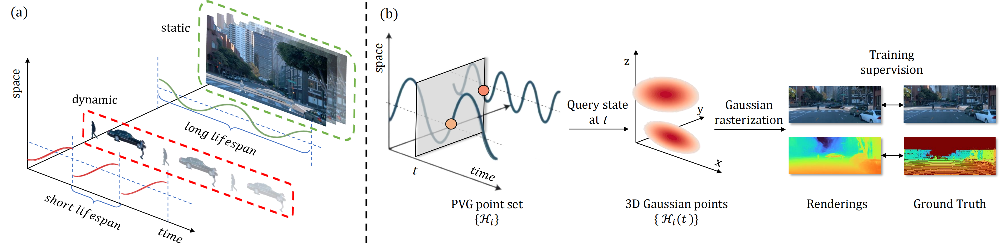

# Periodic Vibration Gaussian: Dynamic Urban Scene Reconstruction and Real-time Rendering
### [[Project]](https://fudan-zvg.github.io/PVG) [[Paper]](https://arxiv.org/abs/2311.18561) 

> [**Periodic Vibration Gaussian: Dynamic Urban Scene Reconstruction and Real-time Rendering**](https://arxiv.org/abs/2311.18561),            
> Yurui Chen, [Chun Gu](https://sulvxiangxin.github.io/), Junzhe Jiang, [Xiatian Zhu](https://surrey-uplab.github.io/), [Li Zhang](https://lzrobots.github.io)  
> **Arxiv preprint**

**Official implementation of "Periodic Vibration Gaussian: 
Dynamic Urban Scene Reconstruction and Real-time Rendering".** 


## 🛠️ Pipeline
<div align="center">
  
</div><br/>

## Get started
### Environment
```
# Clone the repo.
git clone https://github.com/fudan-zvg/PVG.git
cd PVG

# Make a conda environment.
conda create --name pvg python=3.9
conda activate pvg

# Install requirements.
pip install -r requirements.txt

# Install simple-knn
git clone https://gitlab.inria.fr/bkerbl/simple-knn.git
pip install ./simple-knn

# a modified gaussian splatting (for feature rendering)
git clone --recursive https://github.com/SuLvXiangXin/diff-gaussian-rasterization
pip install ./diff-gaussian-rasterization

# Install nvdiffrast (for Envlight)
git clone https://github.com/NVlabs/nvdiffrast
pip install ./nvdiffrast

```

### Data preparation
Create a directory for the data: `mkdir data`.
#### Waymo dataset

Preprocessed 4 waymo scenes for results in Table 1 of our paper can be downloaded [here](https://drive.google.com/file/d/1eTNJz7WeYrB3IctVlUmJIY0z8qhjR_qF/view?usp=sharing). Please unzip and put it into `data` directory.


We extract scenes from [kitti-format Waymo dataset](https://github.com/caizhongang/waymo_kitti_converter). Use the example script `scripts/extract_scenes_waymo.py` to extract the scenes from the Waymo dataset which we employ to extract the scenes listed in StreetSurf. 

Following [StreetSurf](https://github.com/PJLab-ADG/neuralsim), we use [Segformer](https://github.com/NVlabs/SegFormer) to extract the sky mask and put them as follows:
```
data
└── waymo_scenes
    └── sequence_id
        ├── calib
        │   └── frame_id.txt
        ├── image_0{0, 1, 2, 3, 4}
        │   └── frame_id.png
        ├── sky_0{0, 1, 2, 3, 4}
        │   └── frame_id.png
        |── pose
        |   └── frame_id.txt
        └── velodyne
            └── frame_id.bin
```
We provide an example script `scripts/extract_mask_waymo.py` to extract the sky mask from the extracted Waymo dataset, follow instructions [here](https://github.com/PJLab-ADG/neuralsim/blob/main/dataio/autonomous_driving/waymo/README.md#extract-mask-priors----for-sky-pedestrian-etc) to setup the Segformer environment. 

#### KITTI dataset
Preprocessed 3 kitti scenes for results in Table 1 of our paper can be downloaded [here](https://drive.google.com/file/d/1y6elRlFdRXW02oUOHdS9inVHK3U4xBXZ/view?usp=sharinghttps://drive.google.com/file/d/1y6elRlFdRXW02oUOHdS9inVHK3U4xBXZ/view?usp=sharing). Please unzip and put it into `data` directory.

Put the [KITTI-MOT](https://www.cvlibs.net/datasets/kitti/eval_tracking.php) dataset in `data` directory.
Following [StreetSurf](https://github.com/PJLab-ADG/neuralsim), we use [Segformer](https://github.com/NVlabs/SegFormer) to extract the sky mask and put them as follows:
```
data
└── kitti_mot
    └── training
        ├── calib
        │   └── sequence_id.txt
        ├── image_0{2, 3}
        │   └── sequence_id
        │       └── frame_id.png
        ├── sky_0{2, 3}
        │   └── sequence_id
        │       └── frame_id.png
        |── oxts
        |   └── sequence_id.txt
        └── velodyne
            └── sequence_id
                └── frame_id.bin
```
We also provide an example script `scripts/extract_mask_kitti.py` to extract the sky mask from the KITTI dataset.


### Training
```
# Waymo image reconstruction
CUDA_VISIBLE_DEVICES=0 python train.py \
--config configs/waymo_reconstruction.yaml \
source_path=data/waymo_scenes/0145050 \
model_path=eval_output/waymo_reconstruction/0145050

# Waymo novel view synthesis
CUDA_VISIBLE_DEVICES=0 python train.py \
--config configs/waymo_nvs.yaml \
source_path=data/waymo_scenes/0145050 \
model_path=eval_output/waymo_nvs/0145050

# KITTI image reconstruction
CUDA_VISIBLE_DEVICES=0 python train.py \
--config configs/kitti_reconstruction.yaml \
source_path=data/kitti_mot/training/image_02/0001 \
model_path=eval_output/kitti_reconstruction/0001 \
start_frame=380 end_frame=431

# KITTI novel view synthesis
CUDA_VISIBLE_DEVICES=0 python train.py \
--config configs/kitti_nvs.yaml \
source_path=data/kitti_mot/training/image_02/0001 \
model_path=eval_output/kitti_nvs/0001 \
start_frame=380 end_frame=431
```

After training, evaluation results can be found in `{EXPERIMENT_DIR}/eval` directory.

### Evaluating
You can also use the following command to evaluate.
```
CUDA_VISIBLE_DEVICES=0 python evaluate.py \
--config configs/kitti_reconstruction.yaml \
source_path=data/kitti_mot/training/image_02/0001 \
model_path=eval_output/kitti_reconstruction/0001 \
start_frame=380 end_frame=431
```

### Automatically removing the dynamics
You can the following command to automatically remove the dynamics, the render results will be saved in `{EXPERIMENT_DIR}/separation` directory.
```
CUDA_VISIBLE_DEVICES=1 python separate.py \
--config configs/waymo_reconstruction.yaml \
source_path=data/waymo_scenes/0158150 \
model_path=eval_output/waymo_reconstruction/0158150
```


## 🎥 Videos
### 🎞️ Demo
[](https://www.youtube.com/embed/jJCCkdpDkRQ)


### 🎞️ Rendered RGB, Depth and Semantic

https://github.com/fudan-zvg/PVG/assets/83005605/60337a98-f92c-4465-ab45-2ee121413114

https://github.com/fudan-zvg/PVG/assets/83005605/f45c0a91-26b6-46d9-895c-bf13786f94d2

https://github.com/fudan-zvg/PVG/assets/83005605/0ed679d6-5e62-4923-b2cb-02c587ed468c

https://github.com/fudan-zvg/PVG/assets/83005605/3ffda292-1b73-43d3-916a-b524f143f0c9

### 🎞️ Image Reconstruction on Waymo
#### Comparison with static methods

https://github.com/fudan-zvg/PVG/assets/83005605/93e32945-7e9a-454a-8c31-5563125de95b

https://github.com/fudan-zvg/PVG/assets/83005605/f3c02e43-bb86-428d-b27b-73c4a7857bc7

#### Comparison with dynamic methods

https://github.com/fudan-zvg/PVG/assets/83005605/73a82171-9e78-416f-a770-f6f4239d80ca

https://github.com/fudan-zvg/PVG/assets/83005605/e579f8b8-d31e-456b-a943-b39d56073b94

### 🎞️ Novel View Synthesis on Waymo

https://github.com/fudan-zvg/PVG/assets/83005605/37393332-5d34-4bd0-8285-40bf938b849f

## 📜 BibTeX
```bibtex
@article{chen2023periodic,
  title={Periodic Vibration Gaussian: Dynamic Urban Scene Reconstruction and Real-time Rendering},
  author={Chen, Yurui and Gu, Chun and Jiang, Junzhe and Zhu, Xiatian and Zhang, Li},
  journal={arXiv:2311.18561},
  year={2023},
}
```
